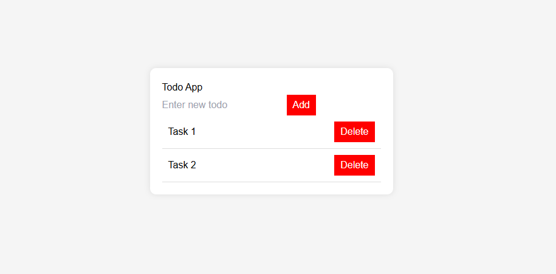

# **📝 Next.js 15 To-Do App (Frontend) 🚀**

This is the frontend for a **To-Do App** built with **Next.js 15**, consuming a Laravel API as the backend and using **MySQL** for data storage.



---

## **📌 Features**
✅ Fetch, create, update, and delete tasks  
✅ API communication using **Axios**  
✅ UI built with **React & Tailwind CSS**  
✅ Server-side rendering (SSR) with Next.js 15  
✅ Optimized performance with **App Router & Layout.tsx**  

---

## **📂 Project Structure**
```
todo-app-frontend-nextjs/
│── src/
│   ├── app/
│   │   ├── layout.tsx  # Main layout
│   │   ├── page.tsx    # Home page (To-Do list)
│   ├── components/
│   │   ├── TodoItem.tsx  # Single To-Do item component
│   │   ├── TodoForm.tsx  # Add/Edit form component
│── public/
│── styles/
│── .env                 # Environment variables
│── next.config.js        # Next.js config
│── package.json         # Dependencies
│── README.md            # This file
```

---

## **⚙️ Installation & Setup**
### **1️⃣ Clone the repository**
```bash
git clone https://github.com/your-username/todo-app-frontend-nextjs.git
cd todo-app-frontend-nextjs
```

### **2️⃣ Install dependencies**
```bash
npm install
```

### **3️⃣ Configure environment variables**
Create a `.env.local` file in the root directory and add:

```env
NEXT_PUBLIC_API_URL=http://127.0.0.1:8000/api
```

### **4️⃣ Run the project**
```bash
npm run dev
```
Your app should now be running at **`http://localhost:3000`** 🎉

---

## **🔌 API Endpoints**
The app interacts with the Laravel backend through these endpoints:

| Method | Endpoint           | Description              |
|--------|-------------------|--------------------------|
| GET    | `/api/todos`       | Fetch all todos         |
| POST   | `/api/todos`       | Create a new todo       |
| PUT    | `/api/todos/{id}`  | Update a todo           |
| DELETE | `/api/todos/{id}`  | Delete a todo           |

Make sure your **Laravel API** is running before starting the frontend:
```bash
php artisan serve
```

---

## **🛠 Tech Stack**
- **Next.js 15** (App Router)
- **React**
- **TypeScript**
- **Axios** (API requests)
- **Tailwind CSS** (Styling)

---

## **🛠 Troubleshooting**
### **"Request failed with status 500"**
- Ensure the Laravel API is running: `php artisan serve`
- Check `.env.local` and confirm `NEXT_PUBLIC_API_URL` is correct
- Run: `composer dump-autoload` in Laravel

### **"CORS policy error"**
- Update `config/cors.php` in Laravel:
  ```php
  'allowed_origins' => ['*'],
  'allowed_methods' => ['*'],
  'allowed_headers' => ['*'],
  ```
- Then, clear the cache:
  ```bash
  php artisan config:clear
  php artisan cache:clear
  ```

---

## **📌 Next Steps**
- ✅ Implement authentication using Laravel Sanctum  
- ✅ Add task filtering & search  
- ✅ Improve UI/UX with animations  

---

## **📜 License**
This project is **MIT licensed**. Feel free to use and modify it! 🚀

---

### Made by `Toscani TENEKE` | `Full-Stack Developer`.
